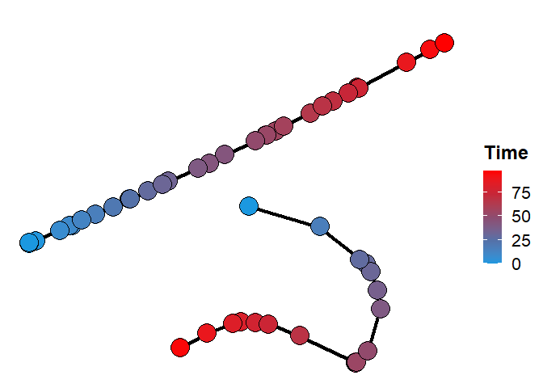

<!-- README.md is generated from README.Rmd. Please edit that file -->

# dbcti

<!-- badges: start -->

<!-- badges: end -->

The goal of dbcti is to support cell trajectory inference analysis for
single-cell RNA-seq data. dbcti is designed to be able to infer any
topological patterns of cell differentiation path and is robust to
noises in single-cell RNA-seq data.

## Installation

The package dbcti is able to be installed from GitHub:

``` r
if (!require('devtools')) install.packages('devtools')
devtools::install_github('tianlt/dbcti')
```

## Example

This is a basic example of using DBCTI:

``` r
library(dbcti)

#### Load data and create cell_trajectory project
sample_data <- create_object(sample_data_df,  normalized = FALSE)

#### Normalize data
sample_data <- normalize(sample_data, gene_cri = 0, cell_cri = 0, scale_factor = 10000)


#### Feature selection
sample_data <- select_var_feature(sample_data, use_normalized_data = FALSE, n = 10)

#### Build tsne plot
sample_data <- tsneplot(sample_data, use_normalized_data = TRUE, perplexity = 5)

#Build contour plot
sample_data <- contour_plot(sample_data)

#Estimate distribution
sample_data <- distribution_estimation(sample_data, ndraw = 50, expansion = 1.5, ... = 1,2,3)

#Calculate possibility for points
sample_data <- point_possibility(sample_data , r = 2)

#Connect cluster
sample_data <- connect_cluster(sample_data)

#Infer_trajectory
sample_data <- infer_trajectory(sample_data, iter_n = 50)

#Calculate pseudotime
sample_data <- calculate_pseudotime(sample_data, start_state_name = c('1','2'))

#Build trajectory plot
sample_data <- plot_trajectory(sample_data)
```

Finally let’s plot the trajectory

``` r
library(dbcti)
plot(sample_data@trajectory_plot$plot)
```



## Issues and bug reports

Please use <https://github.com/tianlt/dbcti/issues> to submit issues,
bug reports, and comments.

## License

DBCTI is distributed under the [GNU General Public License version 2
(GPLv2)](https://www.gnu.org/licenses/old-licenses/gpl-2.0.en.html).
