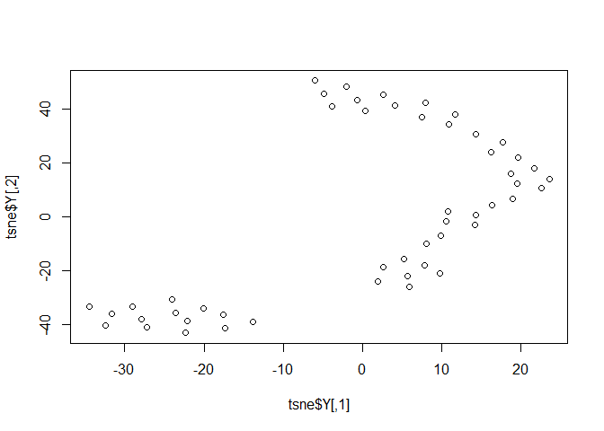
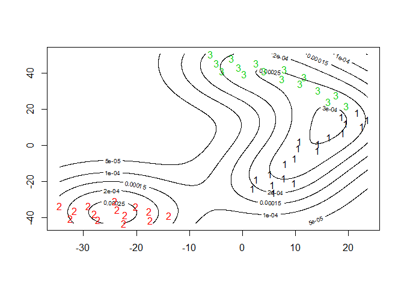
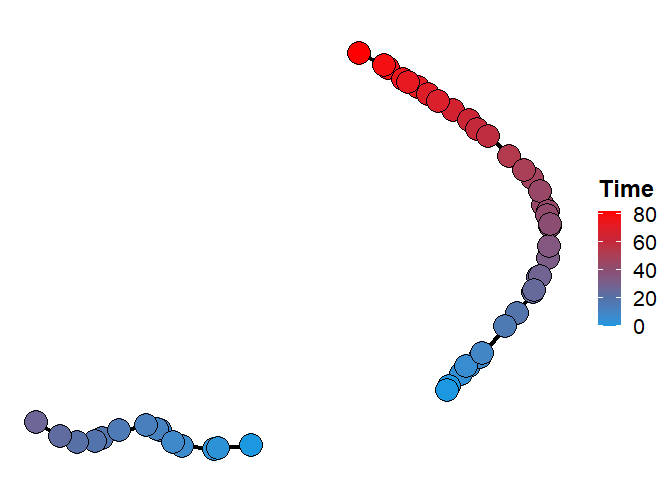

<!-- README.md is generated from README.Rmd. Please edit that file -->

# dbcti

<!-- badges: start -->

<!-- badges: end -->

The goal of dbcti is to support cell trajectory inference analysis for
single-cell RNA-seq data. dbcti is designed to be able to infer any
topological patterns of cell differentiation path and is robust to
noises in single-cell RNA-seq data.

## System requirements

### Hardware Requirements

`dbcti` package is able to perform its operations on a standard
computer.

### OS Requirements

The `dbcti` package should be compatible with Windows, Mac, and Linux
operating systems. The package has been tested on the following systems:

  - Linux 3.10.0
  - Windows 10

### R Dependencies

`dbcti` depends on the following r package

``` r
Rtsne,
FNN,
NMF,
MASS,
mclust,
princurve,
stringr,
igraph,
colorRamps,
rrcov,
grDevices,
methods
prada,
ggplot2
```

## Installation

The package dbcti is able to be installed from GitHub:

``` r
if (!require('devtools')) install.packages('devtools')
devtools::install_github('tianlt/dbcti')
```

The package should take approximately 1 minute to install on a
recommended computer.

If unsuccessful installation of the denpendency package `prada`, please
install separately from Bioconductor:

``` r
if (!requireNamespace("BiocManager", quietly = TRUE))
    install.packages("BiocManager")

BiocManager::install("prada")
```

## Example

This is a basic example of using DBCTI:

``` r
library(dbcti)
#> Warning: package 'rrcov' was built under R version 3.6.3
#> Warning: package 'robustbase' was built under R version 3.6.3
#> Warning: package 'ggplot2' was built under R version 3.6.3

sample_data <- as.data.frame(sample_data)

#### Load data and create cell_trajectory project
sample_dbcti <- create_object(sample_data, normalized = TRUE) 

#### Filter data
sample_dbcti <- filter_data(sample_dbcti, gene_cri = 1, cell_cri = 1, use_normalized_data = TRUE) 


#### Feature selection
sample_dbcti <- select_var_feature(sample_dbcti, use_normalized_data = TRUE, n = 50)

#### Build tsne plot
sample_dbcti <- tsneplot(sample_dbcti, use_normalized_data = TRUE, specified_gene = FALSE, pca = TRUE, perplexity = 10)
```



``` r

#Build contour plot
sample_dbcti <- contour_plot(sample_dbcti)
```



``` r

#Estimate distribution
sample_dbcti <- distribution_estimation(sample_dbcti, ndraw = 100, expansion = 1.5, ... = 1,2,3) 

#Calculate possibility for points
sample_dbcti <- point_possibility(sample_dbcti, r = 5)

#Connect cluster
sample_dbcti <- connect_cluster(sample_dbcti)

#Infer_trajectory
sample_dbcti <- infer_trajectory(sample_dbcti, iter_n =15)

#Calculate pseudotime
sample_dbcti <- calculate_pseudotime(sample_dbcti, start_state_name = c('1','2'))
#> $membership
#> 1 2 3 
#> 1 2 1 
#> 
#> $csize
#> [1] 2 1
#> 
#> $no
#> [1] 2

#Build trajectory plot
sample_dbcti <- plot_trajectory(sample_dbcti)

#Finally let's plot the trajectory
plot(sample_dbcti@trajectory_plot$plot)
```



``` r

#session info is also attached;
sessionInfo()
#> R version 3.6.1 (2019-07-05)
#> Platform: x86_64-w64-mingw32/x64 (64-bit)
#> Running under: Windows 10 x64 (build 18363)
#> 
#> Matrix products: default
#> 
#> locale:
#> [1] LC_COLLATE=English_United States.1252 
#> [2] LC_CTYPE=English_United States.1252   
#> [3] LC_MONETARY=English_United States.1252
#> [4] LC_NUMERIC=C                          
#> [5] LC_TIME=English_United States.1252    
#> 
#> attached base packages:
#> [1] grid      parallel  stats     graphics  grDevices utils     datasets 
#> [8] methods   base     
#> 
#> other attached packages:
#> [1] dbcti_0.1.0         ggplot2_3.3.3       prada_1.62.0       
#> [4] rrcov_1.5-5         robustbase_0.93-6   RColorBrewer_1.1-2 
#> [7] Biobase_2.46.0      BiocGenerics_0.32.0
#> 
#> loaded via a namespace (and not attached):
#>  [1] mclust_5.4.5      Rcpp_1.0.3        mvtnorm_1.1-0     lattice_0.20-38  
#>  [5] FNN_1.1.3         assertthat_0.2.1  digest_0.6.25     foreach_1.4.8    
#>  [9] utf8_1.1.4        gridBase_0.4-7    R6_2.4.1          plyr_1.8.5       
#> [13] stats4_3.6.1      pcaPP_1.9-73      princurve_2.1.6   evaluate_0.14    
#> [17] pillar_1.6.0      rlang_0.4.10      rmarkdown_2.1     labeling_0.3     
#> [21] Rtsne_0.15        stringr_1.4.0     igraph_1.2.4.2    munsell_0.5.0    
#> [25] compiler_3.6.1    xfun_0.12         pkgconfig_2.0.3   pkgmaker_0.32.2  
#> [29] htmltools_0.5.1.1 tidyselect_1.1.0  tibble_3.1.1      codetools_0.2-16 
#> [33] fansi_0.4.1       crayon_1.4.1      dplyr_1.0.5       withr_2.4.2      
#> [37] MASS_7.3-51.4     xtable_1.8-4      gtable_0.3.0      lifecycle_1.0.0  
#> [41] registry_0.5-1    DBI_1.1.0         magrittr_2.0.1    scales_1.1.0     
#> [45] stringi_1.4.6     farver_2.0.3      reshape2_1.4.3    doParallel_1.0.15
#> [49] ellipsis_0.3.1    generics_0.1.0    vctrs_0.3.6       NMF_0.23.0       
#> [53] iterators_1.0.12  tools_3.6.1       glue_1.4.2        DEoptimR_1.0-8   
#> [57] purrr_0.3.4       rngtools_1.5      yaml_2.2.1        colorspace_1.4-1 
#> [61] cluster_2.1.0     knitr_1.28
```

The demo should take approximately 30 seconds to finish running on a
standard computer.

## Issues and bug reports

Please use <https://github.com/tianlt/dbcti/issues> to submit issues,
bug reports, and comments.

## License

DBCTI is distributed under the [GNU General Public License version 2
(GPLv2)](https://www.gnu.org/licenses/old-licenses/gpl-2.0.en.html).
